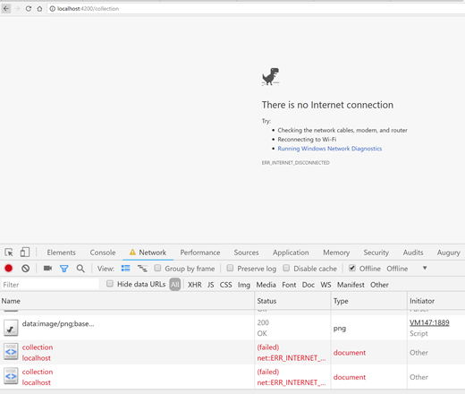
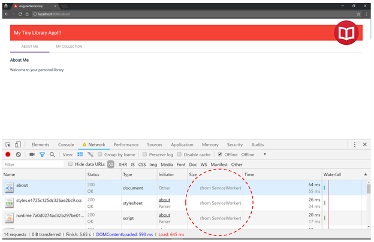

# Progressive Web Applications (PWA)
https://angular.io/guide/service-worker-getting-started

In this module we will introduce some features to the application that makes it behave like a native mobile application. We will add the following features to the application:
1. Offline caching with service workers so your app can work without an internet connection
2. Application manifest to define the look and feel of your app (icons, name, full screen)
3. Install to home screen feature so your web app can be accessed just like any other native app

Before you introduce the service worker to your application try using your application in offline mode by opening the f12 tools and choosing offline mode under the network tab as shown below. Notice that you will be presented by a “There is no Internet connection” message which is the expected behavior of a web application when there is no connection. 



## Add PWA functionality to the app

Make sure that assets/icons folder is empty.

```
ng add @angular/pwa
```


### app.module.ts
```javascript
imports: [
  . . .
ServiceWorkerModule.register('ngsw-worker.js', { enabled: environment.production, registrationStrategy: 'registerImmediately' })
```

## Run the app

If you build your app in production mode, you get your app with a service worker and manifest ready to be deployed. By default, the service worker will cache all JS, CSS, index.html and assets. This only works for production builds because caching Javascript is probably not what you want to do in development mode, where live debugging might be needed using the code you just wrote.

So, we need to execute ```ng build --prod``` and host with another web server.

Make sure the app includes config.prod.json

Note: https://stackoverflow.com/questions/60234452/angular-pwa-error-site-cannot-be-installed-no-matching-service-worker-detected


```
npm install http-server --save-dev
```
### package.json
```json
  "scripts": {
    "http-server": "http-server dist -c-1 -p 8080",
  },
```
```
npm run http-server
```
Naviage to http://localhost:8080/

## Test the app
When testing Angular service workers, it's a good idea to use an incognito or private window in your browser to ensure the service worker doesn't end up reading from a previous leftover state, which can cause unexpected behavior.
To simulate a network issue, disable network interaction for your application. In Chrome:
1.	Open developer tools (F12)
2.	Go to the Network tab
3.	Check the Offline box

Refresh the page and the page should still display even though there is not network connect.



Notice that under the "Size" column, the requests state is (from ServiceWorker). This means that the resources are not being loaded from the network. Instead, they are being loaded from the service worker's cache.

### ngsw-config.json
View the default configuration for cached files.

It uses the prefetch strategy so the service worker places the whole app into the cache and can load it even when the server is offline. 
You can also use the Chrome developer tools to inspect service workers.
Open the developer tools, select the Application tab, and choose Service Workers in the left navigation panel. You can see that the service worker is running.

In the devtools we can:
1. See the service worker
2. Access its source code
3. View its console
4. Simulate offline mode and
5. Unregister it

You can also check the cache storage to see the application files there.

*Tip*: When you are done, make sure to unregister the service worker for the application. Otherwise, it will keep serving the application even when you are not running the server.

## Cache API data
You are not limited to caching local files. You can also enter any URL address and the service worker will include that in the assetGroup.

At this point the About page works perfectly but the My Collection page does not work in offline mode because the external service is unavailable.

The solution is to cache the data in addition to the assets. Besides **assetGroups** there are also **dataGroups**. As per the documentation (https://angular.io/guide/service-worker-config#datagroups), they are not versioned along with the app. They're cached according to manually-configured policies that are more useful for situations such as API requests and other data dependencies. You can check the documentation for the supported options but the most important one is called strategy.
This tells the service worker how to cache the data, where freshness means that the service worker will always try to request newer data and only use the cached data if the request takes too long (or you are offline).

### ngsw-config.json

```json
  "dataGroups": [
    {

        "name": "bookservicelaurie",
        "urls": ["https://bookservicelaurie.azurewebsites.net/**"],
        "cacheConfig": {
            "maxSize": 10,
            "maxAge": "7d",
            "strategy": "freshness"
        }
    }
]

```

## PWA Push Notifications
We will not build this in the HOW session, but steps can be found here:
https://blog.angular-university.io/angular-push-notifications/
